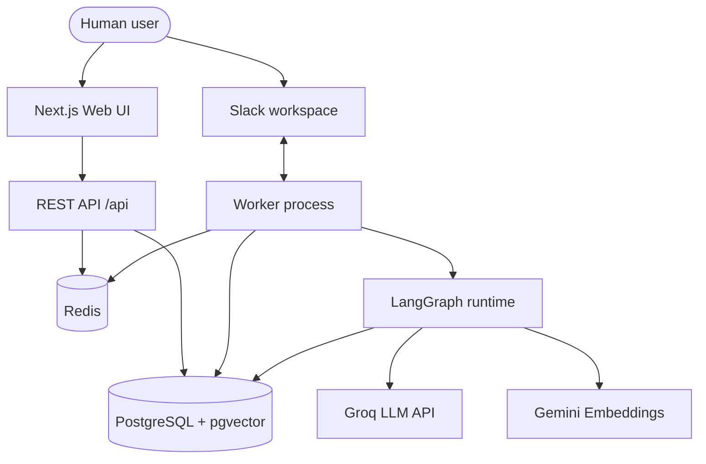
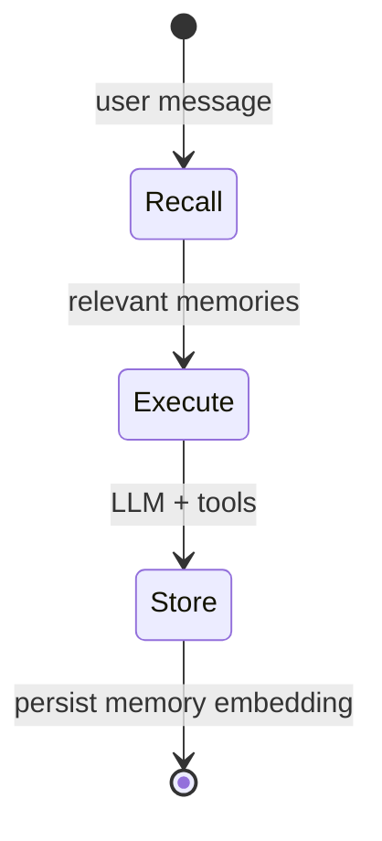
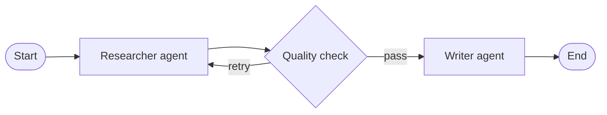
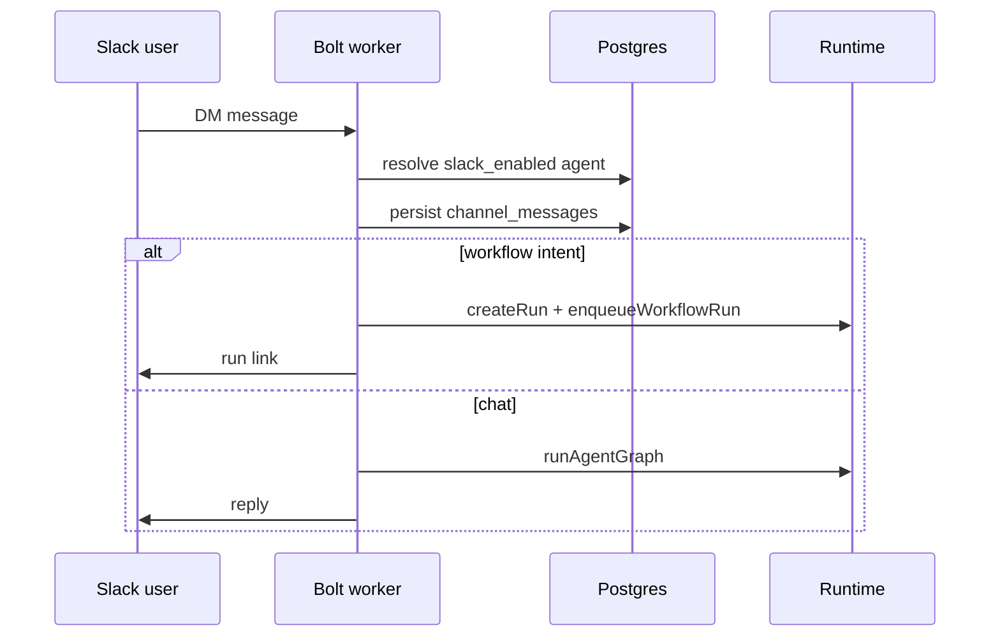
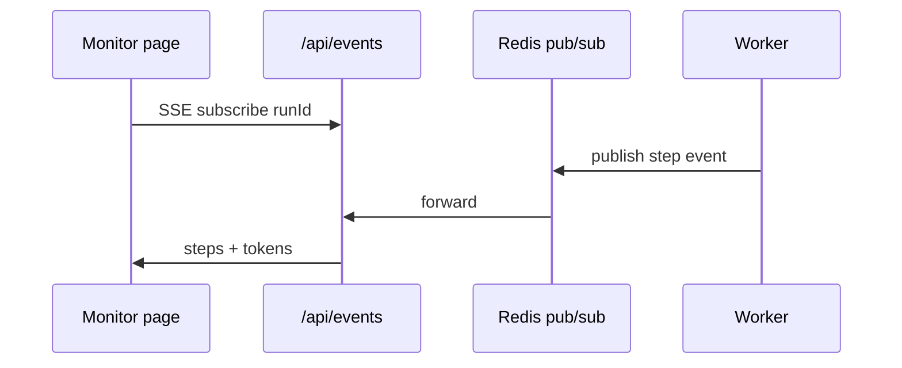
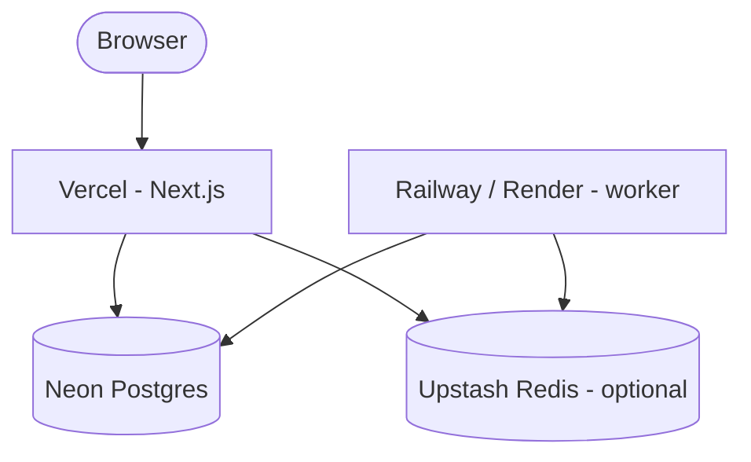

# Architecture & Design

**Multi-Agent Orchestration Platform**  
**Author:** Abhranshu· **Version:** 1.0 · May 2026

> Export tip: open in GitHub or VS Code → Print / Save as PDF (enable background graphics for diagrams).

---

## 1. Overview

Operators define **AI agents** (role, prompt, tools, memory policy), wire them into **directed workflows** with conditional edges, and run work **asynchronously** through a job queue. **Live telemetry** covers logs, inter-agent messages, and token usage. Humans can talk to a **Slack Concierge** over Socket Mode.

Goals: a **real execution runtime** (not UI-only mocks), **clear layer boundaries**, straightforward local setup, and deployability on common free tiers.

---

## 2. System context



---

## 3. Layered architecture

```mermaid
flowchart LR
  subgraph presentation [Presentation layer]
    Pages[App Router pages]
    RF[React Flow editor]
    Mon[SSE Run Monitor]
  end

  subgraph api [API layer]
    AgentsAPI[/api/agents]
    WfAPI[/api/workflows]
    RunsAPI[/api/runs]
    EventsAPI[/api/events SSE]
  end

  subgraph runtime [Runtime layer]
    AG[agentGraph.ts]
    WR[workflowRunner.ts]
    Tools[tool executor]
  end

  subgraph integration [Integration layer]
    SlackBot[Slack Bolt Socket Mode]
    Queue[BullMQ enqueue]
  end

  subgraph data [Data layer]
    PG[(Postgres)]
    Vec[pgvector memories]
  end

  Pages --> AgentsAPI
  Pages --> WfAPI
  RF --> WfAPI
  Mon --> EventsAPI
  RunsAPI --> Queue
  Queue --> WR
  WR --> AG
  AG --> Tools
  AG --> Vec
  SlackBot --> AG
  SlackBot --> WR
  AgentsAPI --> PG
  WfAPI --> PG
  WR --> PG
```

| Layer | Responsibility | Key modules |
|-------|----------------|-------------|
| **Presentation** | CRUD UI, workflow canvas, monitor, channel history | Next.js App Router, React Flow |
| **API** | HTTP boundaries, validation, SSE fan-out | `app/api/*` |
| **Runtime** | Agent graphs, workflow traversal, tools | `src/runtime/*` |
| **Integration** | Slack, async jobs | `src/integrations/slack.ts`, worker |
| **Data** | Persistence, embeddings | PostgreSQL, pgvector |

---

## 4. Agent runtime (LangGraph)

Each agent run uses **recall → execute → store**:



**Why LangGraph:** explicit graph semantics, TypeScript alignment with Next.js, and a path to richer multi-node flows.

**Steps:**
1. **Recall** — embed query, search `agent_memories` (cosine similarity).  
2. **Execute** — system prompt + memory context + user message; Groq completion; optional tools.  
3. **Store** — embed salient output, upsert memory row.

---

## 5. Multi-agent workflows

Workflows are JSON graphs: `nodes` (start, agent, condition, end) and `edges` (optional condition expressions).



**Execution (`workflowRunner.ts`):**
1. Insert `workflow_runs`, enqueue BullMQ (or run **inline** if Redis is down).  
2. Walk from start / `entryNodeId`.  
3. **Agent nodes** — `runAgentGraph`, log `workflow_run_steps`, emit SSE.  
4. **Condition nodes** — evaluate expression; follow matching edge.  
5. **End** — complete run; artifacts e.g. `workspace/report.md`.

Inter-agent payloads land in `agent_messages` for audit and the monitor UI.

---

## 6. Slack integration



**Socket Mode** keeps inbound traffic on an outbound WebSocket — no public webhook URL for local dev.

---

## 7. Live monitoring (SSE)



Without Redis, the UI still loads persisted steps from Postgres on refresh.

---

## 8. Core data model

| Table | Purpose |
|-------|---------|
| `agents` | Definition + `config` JSONB (memory, guardrails, `slack_enabled`) |
| `workflows` | Name, description, `graph` JSONB |
| `workflow_runs` | Status, input/output, timestamps |
| `workflow_run_steps` | Per-step logs, `tokens_used` |
| `agent_messages` | Inter-agent payloads per run |
| `agent_memories` | Text + `vector(768)` |
| `channel_threads` | External conversation threads |
| `channel_messages` | User / assistant history |

---

## 9. Workflow templates

### Research & Report
Researcher (web search) → quality condition → Writer (report file).

### Customer Support Escalation
Concierge triage → severity condition → specialist path.

---

## 10. Testing

| Area | Approach |
|------|----------|
| Tools | calculator, file write |
| Conditions | expression-based routing |
| Messages | `agent_messages` persistence |
| E2E | scripted Research run, token + artifact checks |

Vitest for unit/integration; live LLM avoided where structure suffices.

---

## 11. Deployment topology



| Service | Role |
|---------|------|
| **Vercel** | UI + API routes |
| **Neon** | Managed Postgres + pgvector |
| **Upstash** | Optional Redis for queue + SSE fan-out |
| **Worker host** | BullMQ + Slack (long-lived process) |

---

## 12. Tradeoffs

| Decision | Tradeoff |
|----------|----------|
| LangGraph per-agent + custom workflow walker | Transparent debugging vs single unified graph |
| Groq + Gemini | Two API keys; strong free-tier chat + embeddings |
| Slack Socket Mode | Always-on worker vs simple HTTP webhooks |
| Inline workflow without Redis | Works offline; cross-process SSE needs Redis |
| Doc-first public repo | Clear design narrative; app runs on hosted URL |

---

## 13. Extensibility

- **Template:** JSON graph + seed registration.  
- **Channel:** integration module, worker bootstrap, agent channel flags.  
- **Tool:** register in executor, attach to agent `tools[]`.

---

## 14. Security

- Secrets via environment variables only.  
- Scoped Slack bot + app-level tokens.  
- Neon connections use SSL (`sslmode=require`).

---

*End of document.*
